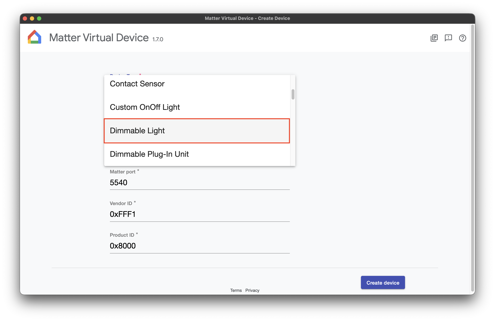
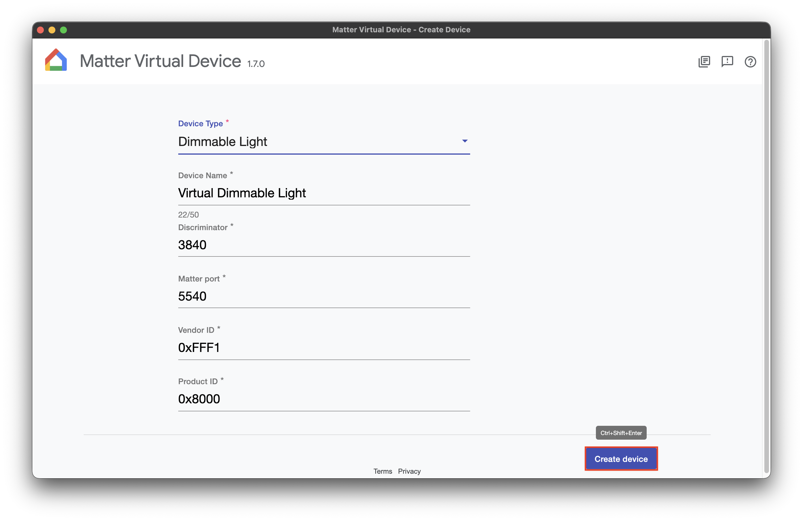
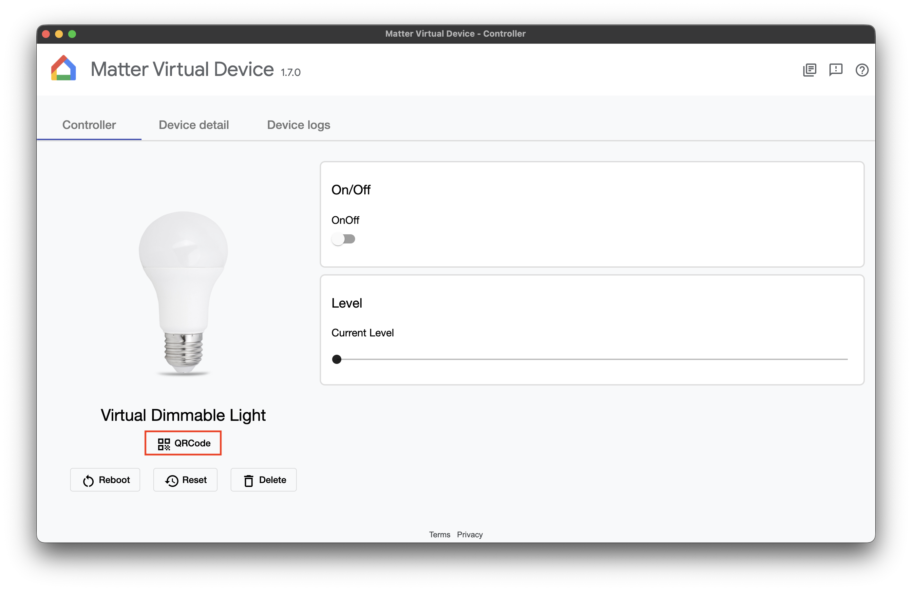
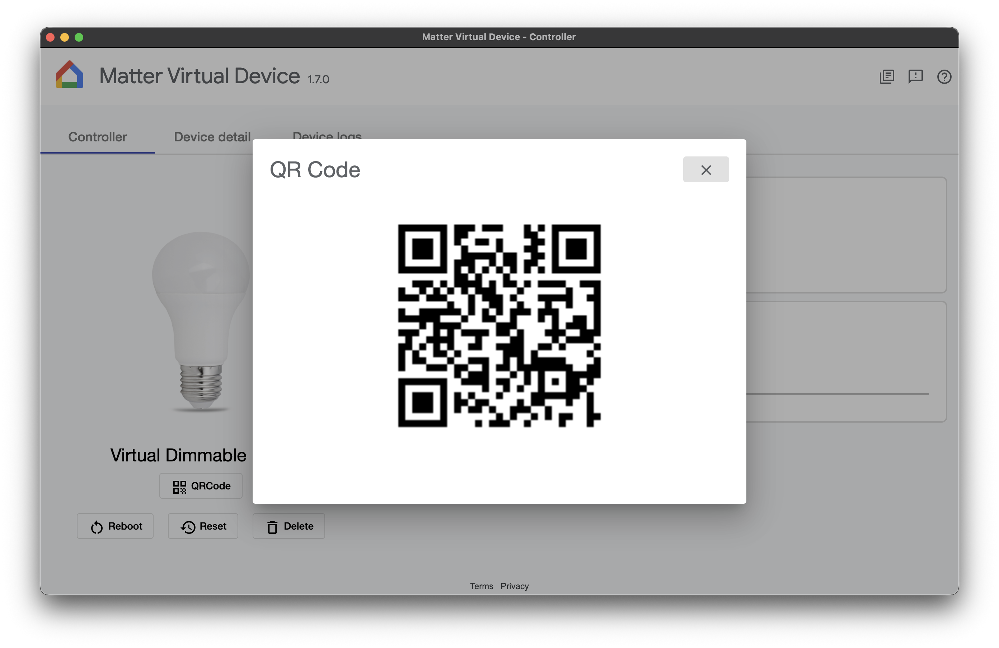

# Onboarding

The onboarding flow can be a little tricky, especially for those who have never worked with Matter
devices before. This document is provided to make the first contact as smooth as possible.

To keep the process simple, the Matter Virtual Device (MVD) is used, as it does not require setting
up a Thread Border Router. All communication happens over Wi-Fi, so both devices — the phone and the
PC running MVD must be connected to the same network.

## Setting up a Matter Virtual Device

The first step is to select one of the supported device types. Device types that are not supported
may still provide partial functionality.

1. This is the initial screen displayed after opening the MVD app.

   

2. Expand the list of available devices and select one of the supported types.

   

3. Press the "Create device" button.

   

4. The device is now created, but not yet commissioned. This screen can later be used to change the
   state of the device. Press "QR code" to display the QR code required for commissioning.

   

5. The displayed QR code is used for commissioning. Once the device has been successfully
   commissioned, the "Device commissioned" label appears and the QR code screen can be closed.

   

## Commissioning a Matter Virtual Device on iOS

The iOS app is available on the [App Store](https://apps.apple.com/ng/app/nrf-matter/id6786253679).

1. This is the initial screen displayed after opening the nRF Matter app.

   

2. Press the "Add New Device" button to start the commissioning flow. Once pressed, control is
   delegated from the main app to an extension managed by the iOS system.

   

3. Access to discovering devices on the local network has to be granted first. This allows the phone
   to detect the MVD device on the same Wi-Fi network.

   

4. The camera is now active and the QR code displayed in the MVD app can be scanned.

   

5. Once the QR code has been scanned and the device detected, a confirmation screen is displayed.

   

6. Because the app connects to an accessory that is under development and lacks proper certification,
   the "Add Anyway" button must be pressed to proceed.

   

7. The next screen asks for the location to which the device should be added. The selected location
   has no meaning in this app, so the first option is sufficient. Press "Continue".

   

8. A custom name can be assigned to the device, although it is not used in the current version of the
   app. Press "Continue".

   

9. Press "Done" on the confirmation screen. Control is then returned to the nRF Matter app.

   

10. The main screen looks like this. All commissioned devices are listed here, together with the
    components related to their specific device type and functionality.

    

11. Pressing a device expands its content.

    

    

12. Pressing "Matter Device information" opens a new section with detailed information about the
    device.

    

    

## Summary

At this point the Matter Virtual Device is created, commissioned and controllable from the nRF Matter
app. The same flow applies to physical Matter accessories, with the only difference being that it may
need a Thread Border Router available in the same Wi-Fi network. Once the setup has been completed,
the device remains commissioned and does not need to be added again, unless it is removed from the app.

If a device cannot be discovered during commissioning, it is worth verifying that both the phone and
the PC running MVD are on the same Wi-Fi network and that local network access has been granted to
the app. Feedback and issue reports are welcome in the project's issue tracker.
