# Onboarding

An onboarding flow can be little tricky, especially for people who never had nothing to do with 
Matter devices. To make the first contact smooth this detail doc is provided. To make the process 
easier it is using Matter Virtual Device (MVD) as it doesn't require setting up a Thread Boarder router.
All communication happens over Wi-Fi so both devices: phone and PC on which MVD is running must be
on the same network.

## Setting up a Matter Virtual Device
First the user needs to select one of supported Device Types. Even if the device is not supported
then it may provide partial functionality.

1. This is the initial screen after opening MVD app.
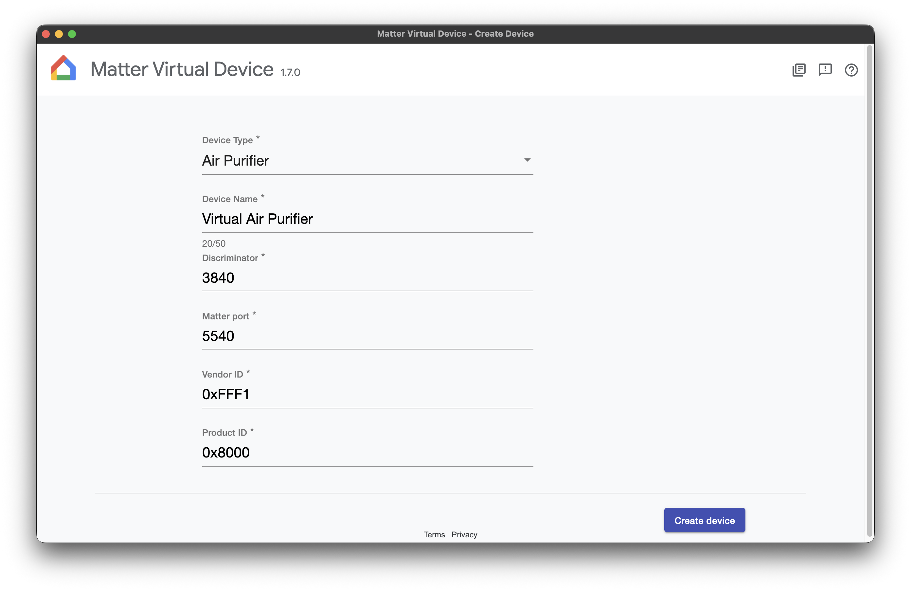
2. Expand list of available devices and select one of the supported types.
[Screenshot](doc/assets/2_highlight.png)
3. Press "Create device" button
[Screenshot](doc/assets/3_highlight.png)
4. Now the device is created but not yet commission. Later this screen can be used for changing 
state of the device. Press "QR code" to show qr code needed for commissioning.
[Screenshot](doc/assets/4_highlight.png)
5. The displayed QR code can be used for commissioning. After device is successfully commissioned
a label "Device commissioned" is displayed. After that the screen with QR code can be closed.

## Commissioning a Matter Virtual Device on iOS

The iOS app can be downloaded on [AppStore](https://apps.apple.com/ng/app/nrf-matter/id6786253679). 

1. This is the initial screen after opening nRF Matter app.
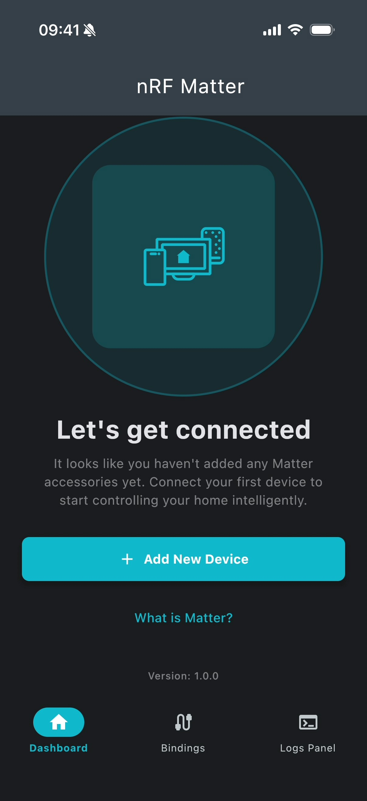
2. Press "Add New Device" button to start a commissioning flow. After pressing this button the 
control is delegated from main app to an extension that is managed by iOS system.
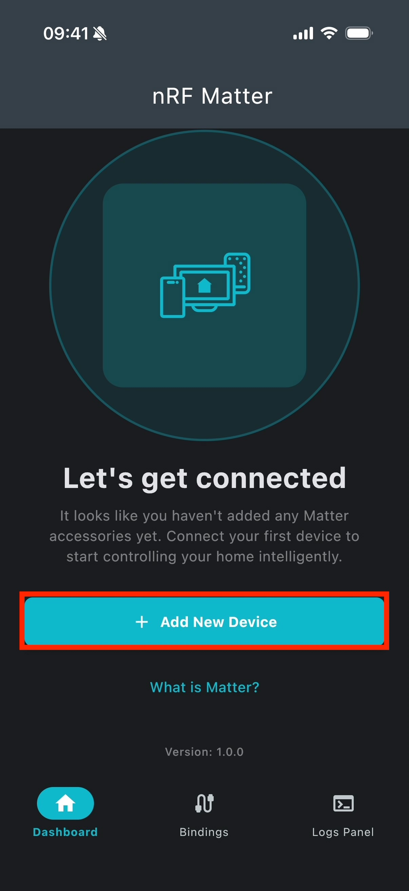
3. First the user needs to grant access for discovering devices in a local network. Thanks to that
the phone will be able to detect MVD device on the same Wi-Fi network.
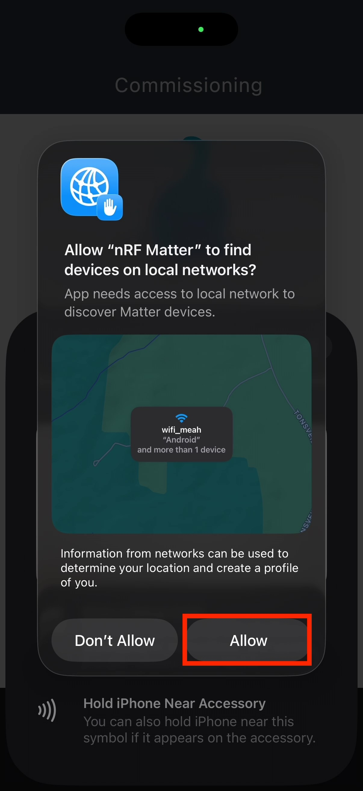
4. Now, the camera is working and is it the moment to scan QR code displayed in MVD app.
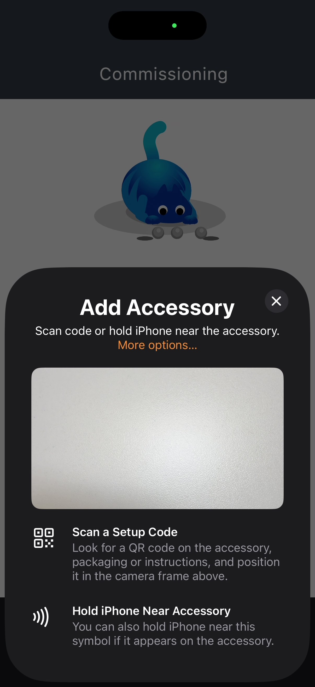
5. After QR code is scanned and the device is detected a confirmation screen is displayed.
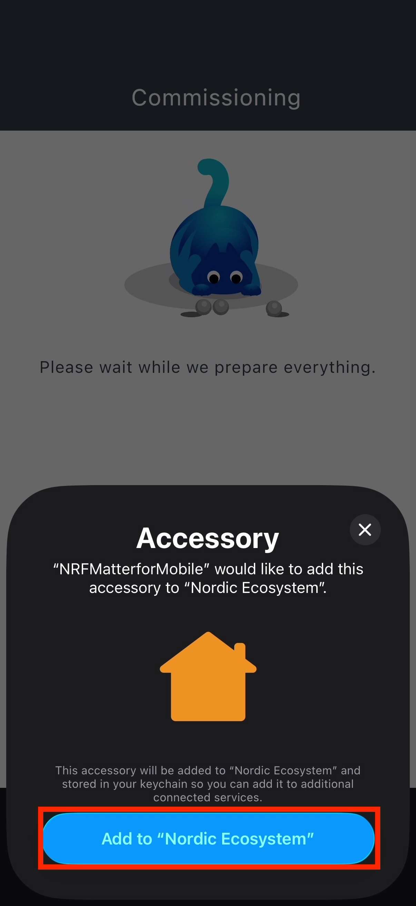
6. Because the app is trying to connect to accessory under development and it is missing a proper 
certification then to proceed we need to press "Add Anyway" button.
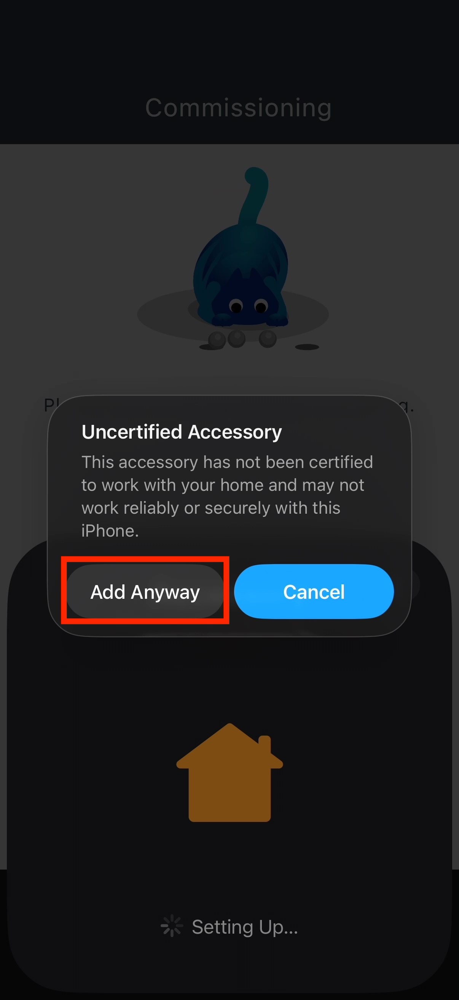
7. The next screen is asking about location to which the device should be added. It may be used
for better organisation purpose but in this app it has no deeper meaning so we can just choose the
first option. Press "Continue."
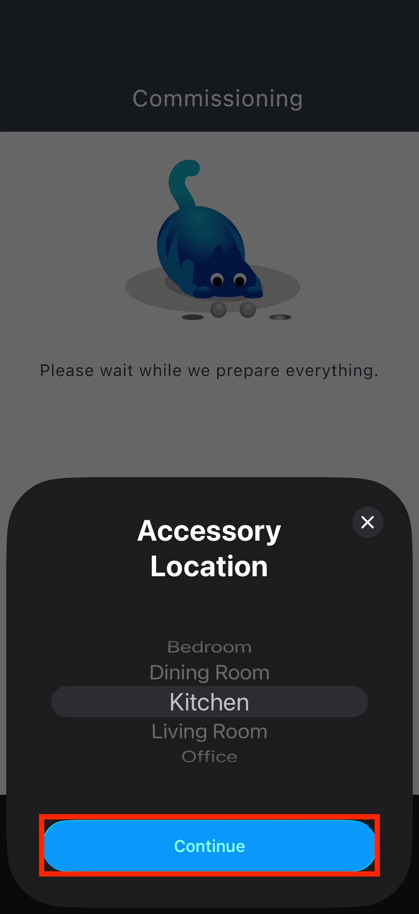
8. There is a possibility to give a custom name for a device but it is not really used in a current
version of the app. Press "Continue".
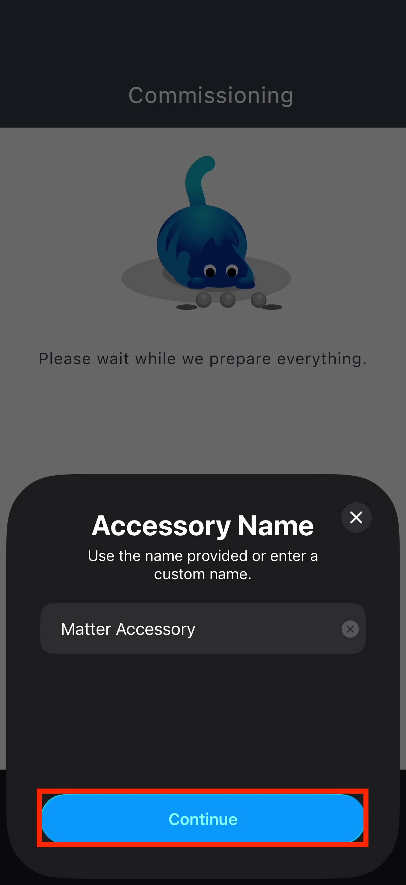
9. Press "Done" on confirmation screen. After that the control should be returned to nRF Matter app.
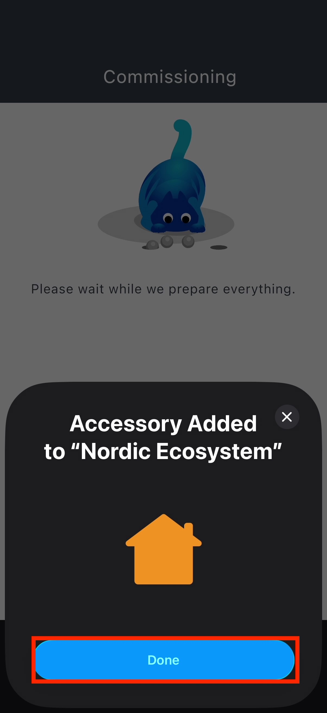
10. The main screen look like this. All commissioned devices are displayed here. Components related
to a specific device type and its functionality should be displayed here.
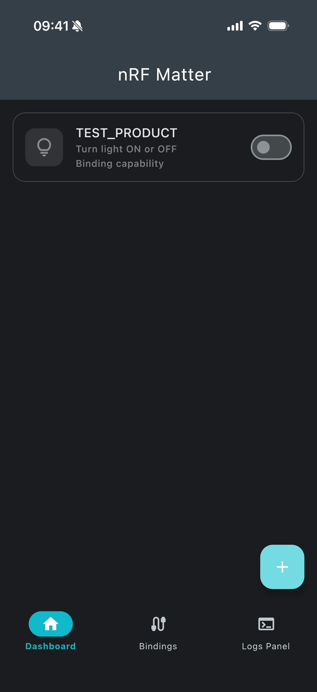
11. By pressing a device more content is expanded.
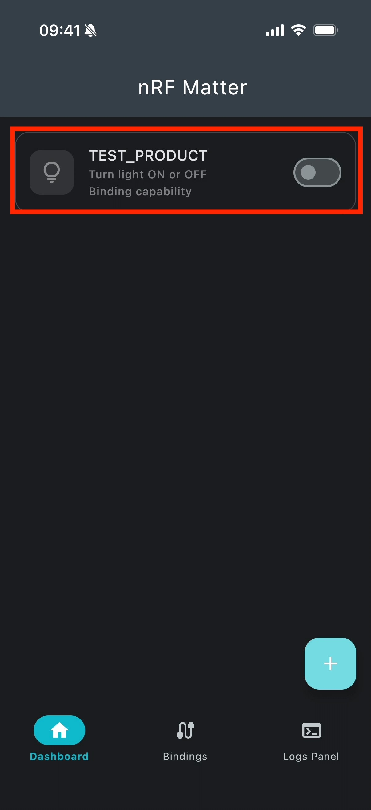
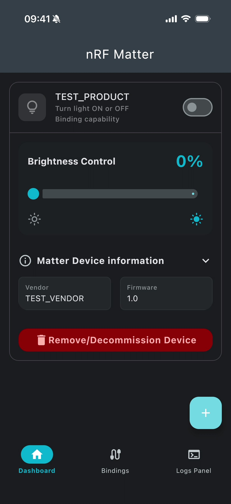
12. By pressing "Matter Device information" a new section is opened with detailed information about
the device.
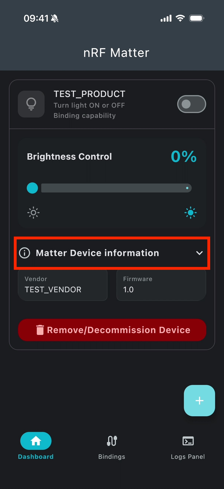
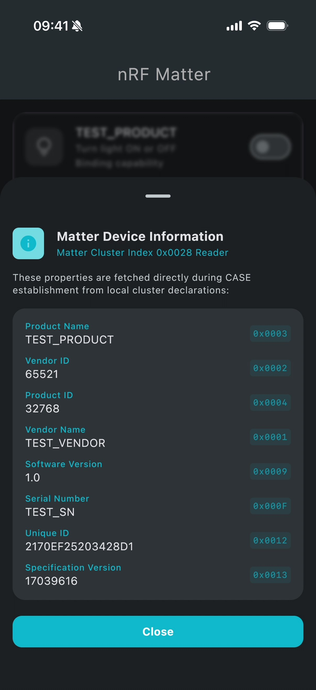