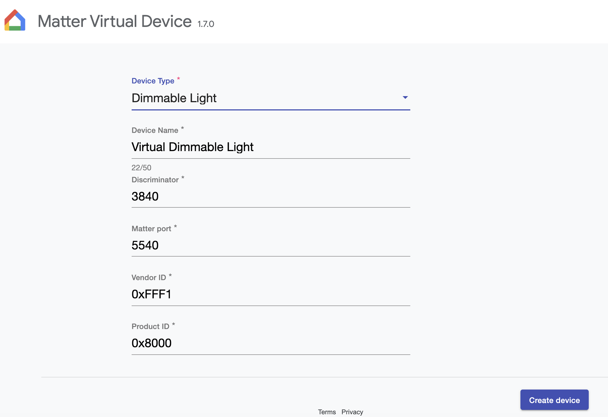
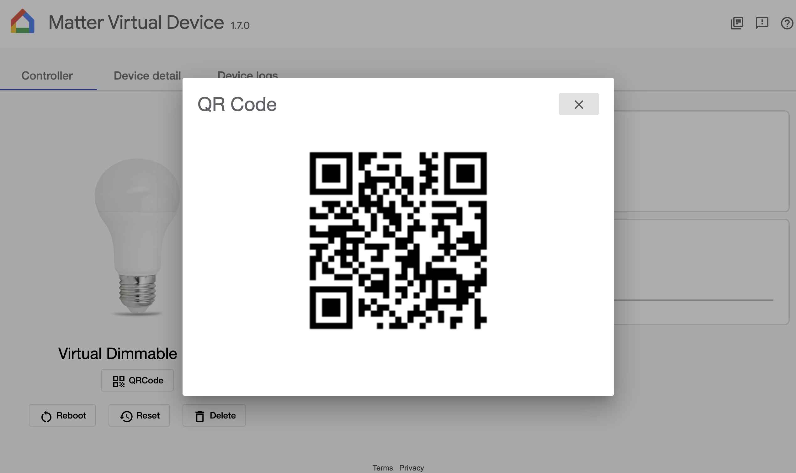
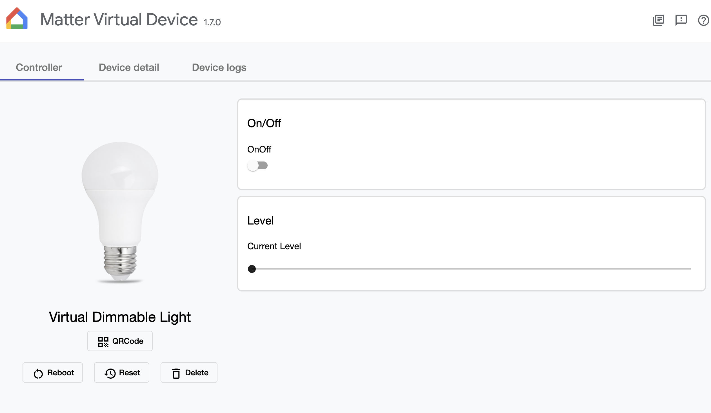
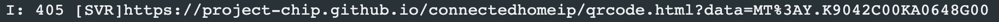
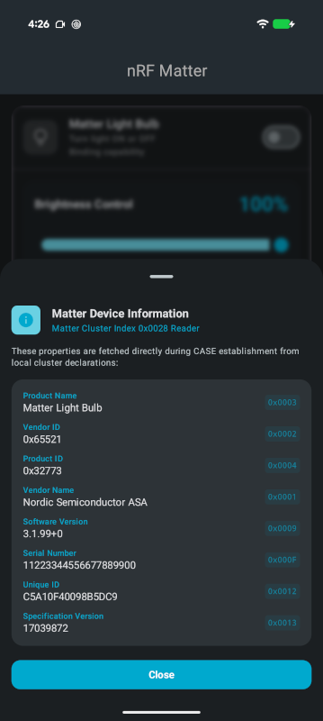
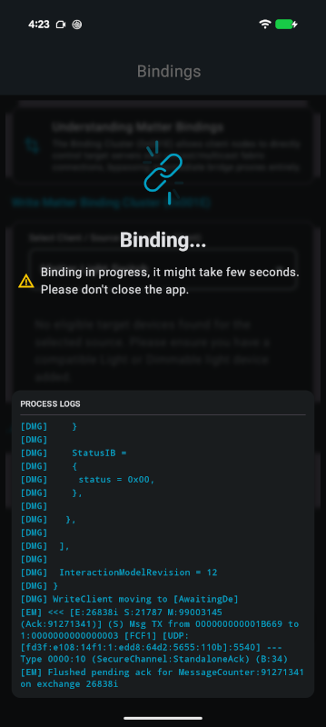
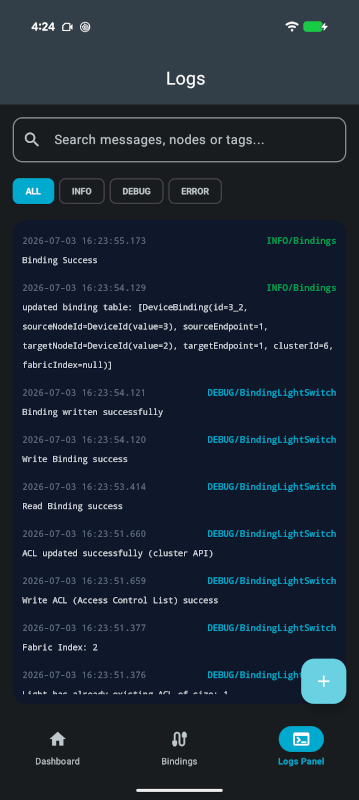

# nRF Matter for Mobile

 

nRF Matter for Mobile is a commissioning and control companion app by [Nordic Semiconductor](https://www.nordicsemi.com/) for the [Matter](https://www.nordicsemi.com/Products/Technologies/Matter) protocol. The app is available for Android and iOS. It is built with Kotlin Multiplatform and Compose Multiplatform, with the iOS-specific implementation written in Swift.

 

For Matter developer documentation from Nordic Semiconductor, see the [nRF Connect SDK](https://nrfconnectdocs.nordicsemi.com/ncs/latest/nrf/installation/install_ncs.html) and [Matter add-on](https://nrfconnectdocs.nordicsemi.com/addons/ncs-matter/latest/index.html) documentation.

---

**Contents:** [Features](#features) · [Minimum OS Requirements](#minimum-os-requirements) · [Supported Matter device types](#supported-matter-device-types) · [Working with the app](#working-with-the-app)

## Features

The app acts as a Matter **controller and administrator** on its own local fabric. It commissions accessories, keeps their node IDs and credentials, reads and writes their clusters, and writes Access Control List and Binding Cluster entries on them.

The application supports the following features:

* **Commissioning** new Matter devices onto your fabric:
    * Android — through the Android Home API and Google Play Services, provisioning the device onto both the Google Home fabric and the app's local fabric.
    * iOS — through Apple's `MatterSupport` framework (`MatterAddDeviceRequest`), onto a local fabric managed directly by the app itself (using `Matter.framework` and `MTRDeviceController`), with a bundled app extension providing the system QR-code scanning UI.
* **Controlling** commissioned devices — door locks, light bulbs (dimmable light bulb), switches, and manufacturer-specific clusters.
* **Managing bindings** between devices, for example a light switch controlling a light bulb directly.
* **Viewing logs** for diagnosing commissioning and cluster interactions.

The app is built in Compose Multiplatform, the user interface provides identical screens, labels, and controls across both Android and iOS. The app automatically adapts to the system theme on both
platforms. The only platform-specific behavior occurs during commissioning, where execution is handed off to the native operating system — Google Play Services on Android and Apple’s `MatterSupport` on iOS.

Upon launch, the app opens to the Dashboard. If no accessories have been commissioned, a Getting Started screen appears with options to begin setup, access Matter documentation, and view the app version. Once a device is commissioned, the Dashboard dynamically updates to display the list of commissioned devices.

---

## Minimum OS Requirements

To download and run the nRF Matter application, your device must meet the following OS requirements:

* Android OS: Android 8.1 (API level 27) or newer.
* iOS / iPadOS:

  * iOS 26.0 or newer. Both the vendored [`/ios-matter`](./ios-matter/Package.swift) package and the Xcode targets set that as their minimum, because the Apple `Matter` and `MatterSupport` APIs the app relies on are only available there.
  * Xcode: Building requires Xcode 26+, recent enough for `swift-tools-version: 6.3`.

---

## Supported Matter device types

The application implements controls for the following Matter device types. Accessories reporting any other device type can still be commissioned and inspected, but not controlled.

| Device type                  | Matter device type ID | Controls available in the app |
|------------------------------|-----------------------|-------------------------------|
| On/off light                 | `0x0100`              | On/off switch only |
| Dimmable light               | `0x0101`              | On/off switch, brightness control |
| Door lock                    | `0x000A`              | Lock/unlock control  |
| Light switch                 | `0x0103`              | None - this is a client node configured on the Bindings screen |
| Manufacturer-specific device | `0xFFF10001`          | Generate number, LED switch, button state  |

---

## Working with the app

**Contents:** [Requirements](#requirements) · [Preparing a Matter device](#preparing-a-matter-device) · [Thread network credentials](#thread-network-credentials) · [Commissioning devices](#commissioning-devices) · [Checking device information](#checking-device-information) · [Configuring bindings](#configuring-bindings) · [Viewing logs](#viewing-logs) · [Removing a device](#removing-a-device)

---

### Requirements

This section lists additional OS-specific requirements for working with the app and Matter devices.

#### Android requirements

To use the nRF Matter application with Matter devices, make sure you meet the following hardware and software requirements for your operating system. These are separate from [Minimum OS requirements](#minimum-os-requirements) for running the app.

*  Android APIs

  * Google Play Services: Required, specifically with access to Google's Home API (used for local fabric and ecosystem device commissioning).

* Hardware & Architecture

  * Physical Device Required: The nRF Matter app requires a physical device to perform commissioning. It will not run on Android Emulators.
  * 64-bit Architecture Only (`arm64-v8a`): The app relies on compiled native CHIP/Matter libraries (`libCHIPController.so`) built specifically for 64-bit ARM processors.

* Permissions & Device Profiles

  * Local Network & Bluetooth Permissions: The app requires explicit user permission for Camera and Bluetooth (for initial Bluetooth LE commissioning).

* Thread & Network Prerequisites

  * Thread Border Router (for Thread devices): If you are commissioning Matter-over-Thread hardware using the app, a Thread Border Router (such as a Nest Hub or Google TV Streamer 4K) must be configured on the same Wi-Fi subnet. For more information, see [Thread network credentials](#thread-network-credentials).
  * Wi-Fi Subnet: The Android device must be connected to a Wi-Fi network that supports IPv6 and allows mDNS traffic without client isolation.
  * Bluetooth Low Energy (Bluetooth LE): Required for initial Matter device discovery and Bluetooth LE commissioning.

* Account and Companion Prerequisites

  * Google Account: An active Google account signed in on the phone (required for Google Home API/Play Services authentication during commissioning). For Thread devices, the same Google Home app account is used to share Thread network credentials with the nRF Matter app once a border router is on the network.

#### iOS requirements

To run the nRF Matter app on an Apple device, the hardware and software must meet the following requirements:

* Hardware & Architecture

  * 64-bit iOS Device: Requires an iPhone or iPad powered by a 64-bit Apple Silicon chip (A-series) with physical Bluetooth LE capabilities.
  * Simulator vs. Physical Device: While app UI can run in the Xcode simulator, device commissioning requires a physical iPhone or iPad to handle Bluetooth LE scanning and local network multicast discovery.

* Permissions & Device Profiles

  * Local Network & Bluetooth Permissions: The app requires explicit user permission for Local Network (to discover mDNS nodes) and camera and Bluetooth (for initial Bluetooth LE commissioning).
  * iCloud Account: An active Apple ID/iCloud account signed in to the iPhone is required to sync and manage local Matter fabric keys securely.

* Thread & Network Prerequisites

  * Thread Border Router (for Thread devices): If you are commissioning Matter-over-Thread hardware using the app, a Thread Border Router (such as a Nest Hub or Google TV Streamer 4K) must be configured on the same Wi-Fi subnet. For more information, see [Thread network credentials](#thread-network-credentials).
  * Wi-Fi Subnet: The iOS device must be connected to a Wi-Fi network that supports IPv6 and allows mDNS traffic without client isolation.

---

### Preparing a Matter device

To work with the application you need a Matter-enabled accessory device. Use one of the following ways of getting one:

* Using [Matter Virtual Device](#matter-virtual-device). It works over a local network and is easier to set up.
* Using one of [Nordic Semiconductor development kits](#nordic-semiconductor-development-kits). This requires a working Thread Border Router accessible on the local network.

Both approaches are explained in the following sections.

#### Matter Virtual Device

If you do not have a Thread Border Router or a physical accessory at hand, Google's
[Matter Virtual Device](https://developers.home.google.com/matter/tools/virtual-device) (MVD) tool
lets you commission a simulated Matter accessory from a Mac or Linux machine instead.

The nRF Matter implementation currently supports only a subset of the device types available in the
Matter Virtual Device application:

* Dimmable Light
* Door Lock

To explore and test additional device types, a compatible Nordic development kit is required.

##### How to test without a hub

To test without a hub, complete the following steps:

1. Make sure that the Mac/Linux running MVD and the phone **must be on the same Wi-Fi network**.
1. Download the MVD `.dmg` for your Mac (Apple Silicon or Intel) and drag it into `Applications`.
   You can download the Matter Virtual Device from the [official Google Home developer resources](https://developers.home.google.com/matter/tools/virtual-device#install_mvd).
1. Launch MVD and configure the simulated accessory: device type, name, discriminator, Matter port, and test VID/PID.

    After launching the application, the initial screen looks as follows:

    

1. Commission the simulated accessory from this app like a real device.

    The accessory shows a QR code and joins over the existing Wi-Fi® connection of the macOS host.

    

Once commissioned, you can control the simulated accessory device from the MVD dashboard.

#### Nordic Semiconductor development kits

You can configure a Nordic Semiconductor development kit to act as a Matter device using one of the available Matter samples:

* Matter Door Lock
* Matter Light Bulb
* Matter Light Switch
* Matter Manufacturer-specific clusters

For the authoritative, up-to-date list of supported hardware, see Nordic's [Matter hardware and memory requirements](https://nrfconnectdocs.nordicsemi.com/addons/ncs-matter/latest/matter/getting_started/hw_requirements.html) page - new development kits and SoCs are added there as they gain Matter support.
You can also check the [sample documentation](https://nrfconnectdocs.nordicsemi.com/addons/ncs-matter/latest/samples/index.html) for the list of development kits supported by each sample.

These samples can be installed using the [Matter Quick Start app](https://docs.nordicsemi.com/r/bundle/nrf-connect-for-desktop/page/matter-quick-start-app), which is a part of [nRF Connect for Desktop](https://www.nordicsemi.com/Products/Development-tools/nRF-Connect-for-Desktop/Download). Alternatively, you can install them from the [Matter add-on to the nRF Connect SDK](https://nrfconnectdocs.nordicsemi.com/addons/ncs-matter/latest/index.html).

  
Finding the commissioning QR code

All samples print a link with the QR code required for commissioning in their logs. The logs from a development kit can be viewed using the [Serial Terminal app](https://docs.nordicsemi.com/r/bundle/nrf-connect-for-desktop/page/serial-terminal-app).

To view the logs, open the Serial Terminal app and connect the kit using the appropriate serial port. If the device has not yet been commissioned, press the reset button on the kit. The device then prints the logs, including the QR code link, in the logs panel.

---

### Thread network credentials

**Note:** If your accessory does not use Thread, go to [Commissioning devices](#commissioning-devices).

Commissioning a Thread Matter device requires a Thread Border Router already running on the local network, and Thread network credentials available on the phone.

This setup is not part of the application. It relies on the home hub infrastructure provided by the operating system, which is configured once per network before the app is used.

#### How to install Thread network credentials on iOS

Matter samples installed on development kits require a Thread Border Router connected to the same local network as the app. In addition, the iPhone must already have the corresponding Thread network credentials installed. The credentials are installed through the system API and are available to all apps on the phone.

The process for obtaining these credentials depends on the Thread ecosystem being used. In most cases, when the Thread network is provided by a device such as a TV or a dedicated hub, the manufacturer's companion app must be used to download and install the Thread network credentials on the iPhone. This can be for example Samsung's [SmartThings](https://apps.apple.com/us/app/smartthings/id1222822904) app or Google's [Google Home](https://apps.apple.com/us/app/google-home/id680819774) app.

For detailed instructions, refer to the documentation provided by the device manufacturer. In general, the required credentials are installed after signing in to the companion app, adding the Thread-enabled device to the home, and enabling its Thread Border Router functionality.

If the credentials are not immediately available, commissioning a Matter device using the corresponding companion app may trigger the download and installation of the Thread network credentials.

**Note:** The app has been tested with the Google TV Streamer 4K. At the time of writing, Google does not provide any alternative method for installing or sharing Thread network credentials on iPhone other than through the Google Home app.

#### How to install Thread network credentials on Android

Set up a Thread Border Router, such as a Nest Hub (2nd generation) or a Google TV Streamer 4K, through the Google Home app. Google Play Services, by way of the Home API, then makes the credentials available to this app in the same way.

Keep in mind the following requirements:

| Requirement | Details |
| --- | --- |
| Same Wi-Fi network | The phone and the hub must be on the same Wi-Fi network. Credential and device discovery relies on local-network multicast (mDNS), which does not cross subnets or routers. |
| User account signed in | The hub needs a user account signed in before it shares any credentials. A freshly unboxed hub with no account will not work. |
| IPv6 enabled | Make sure the router on the network has IPv6 enabled. Without it, Thread commissioning can appear to succeed, but device control might fail afterward. |

Tip: How to share one hub between platforms

Matter standardizes Thread credential sharing across ecosystems, so a single hub can plausibly serve both platforms. For example, a Google TV Streamer 4K set up once in Google Home has been observed working for both iOS and Android commissioning in this app, without a separate Apple-ecosystem hub.

---

### Commissioning devices

Commissioning adds a Matter accessory to the app's fabric so it can be controlled. Before you start, make sure you have a [prepared Matter device](#preparing-a-matter-device) and, for Thread accessories, set up [Thread network credentials](#thread-network-credentials).

If commissioning a Thread accessory, an active Thread Border Router (such as Google TV Streamer 4K) must be present on the
local network and the Thread network credentials must be known to the phone.

For information about Matter commissioning stages, see [Matter network commissioning](https://nrfconnectdocs.nordicsemi.com/addons/ncs-matter/latest/matter/overview/commissioning.html#matter-network-commissioning) in the Matter add-on documentation.

#### How commissioning with the app works

When you add a new device in the app on your phone and scan the device’s QR code or manually enter the setup payload (discriminator and PIN), the following happens:

1. The app scans for the accessory's Bluetooth LE advertising signal to establish an initial secure connection.
1. Once connected over Bluetooth LE, the app authenticates the accessory, provisions your local network credentials (Thread or Wi-Fi), and adds the device to your Matter fabric.
1. Once network credentials are provisioned and the fabric is bound, the app reads the accessory's Descriptor (`0x001D`) and Basic Information (`0x0028`) clusters. This allows the app to determine the device type, render the correct UI controls, and extract hardware metadata like the Product Name and Vendor ID.

The accessory is then added to the dashboard for further control or inspection as a functional Device Card.

**Note:** The pairing UI belongs to the operating system. Scanning the QR code, choosing the network, and naming the device are all handled by the operating system, not by this app.

#### How to commission on Android

To commission on Android:

1. Ensure your Android device is connected to the same network you plan to commission the Matter accessory onto and that Bluetooth is turned on.
1. Start the nRF Matter for Mobile app on your Android device.

   ")

1. Tap **+ Add New Device** on the Getting Started screen (or the floating **+** button if devices are
   already present).
1. If you have not done so before, grant the app camera and Bluetooth permissions.
1. Provide the required setup information using one of the following options:

   * Scan the accessory's Matter QR Code using the on-screen viewfinder
   * Tap **Setup with Code** to manually enter the 11-digit or 21-digit setup payload (Discriminator and PIN
   Code).

The app initiates the Matter network commissioning stages. Once done, the device is added to the Matter fabric and the app is updated with the new device card. For example, the Matter Light Bulb in the following image.

")

#### How to commission on iOS

To commission on iOS:

1. Ensure your iOS device is connected to the same network you plan to commission the Matter accessory onto and that Bluetooth is turned on.
1. Start the nRF Matter for Mobile app on your iOS device.

   ")

1. Tap **+ Add New Device** on the Getting Started screen (or the floating **+** button if devices are
   already present).
1. If you have not done so before, grant the app camera and Bluetooth permissions.
1. Scan the accessory's Matter QR Code using the on-screen viewfinder to provide the required setup information.

The app initiates the Matter network commissioning stages. Once done, the device is added to the Matter fabric and the app is updated with the new device card.
For example, the `Test_Product` (Matter Light Bulb) in the following image.

")

#### What if commissioning fails

If the onboarding process encounters an error such as an invalid setup payload, timeout, or failed network authentication, the app halts the setup and displays a **Connection Failed** screen with suggested steps to troubleshoot the connection and the following information:

| Field            | Description  |
|------------------|--------------|
| Commissioning ID | Identifier of the commissioning attempt, useful for correlating with the log. |
| Error Code       | The error reported by the platform or the Matter stack. |
| Stage            | Where the failure happened: during commissioning, while reading Basic Information, or while reading the Descriptor cluster. |
| Message          | The underlying error message. |

Tip: How to commission an accessory that was paired before

An accessory only accepts commissioning while it is in commissioning mode, and it keeps the credentials of fabrics it has already joined. If a device was previously paired — including a device that was force-removed from this app — factory reset it before commissioning it again.

---

### Checking device information

Once commissioned, your accessory is added to the app dashboard as a dedicated device card. Tap the device card to display information about the device read from the device's Basic Information cluster (`0x0028`).

This information is available for all commissioned accessories.

| Field                 | Attribute |
|-----------------------|-----------|
| Product Name          | `0x0003`  |
| Vendor ID             | `0x0002`  |
| Product ID            | `0x0004`  |
| Vendor Name           | `0x0001`  |
| Software Version      | `0x0009`  |
| Serial Number         | `0x000F`  |
| Unique ID             | `0x0012`  |
| Specification Version | `0x0013`  |

---

### Configuring bindings

Bindings are used to assign a target or targets of a client cluster on the node, so that the device knows which remote device it should act upon.

In the app, the Bindings screen configures the Binding Cluster (`0x001E`) to allow a source node, such as a light switch, to control a target node directly over the Matter fabric, without routing each command through the app. For example, once the binding is established, a light switch can communicate directly with and control a connected light bulb.

**Note:** Only unicast binding is currently supported.

For more information about bindings and other Matter network concepts, see the [Matter add-on documentation](https://nrfconnectdocs.nordicsemi.com/addons/ncs-matter/latest/matter/overview/network_topologies.html#matter-network-topology-and-concepts).

#### How to write a binding

To write a binding, you need to fill in information in the **Write Matter Binding Cluster (0x001E)** section.

**Note:** Binding is currently supported only for the On/Off Cluster `(0x0006)`.

Complete the following steps:

1. Make sure you have commissioned at least one accessory device before creating a binding.
1. Open the **Bindings** screen.
1. Under **Select Client / Source Node (Write Client)**, select the source node that will send commands (for example, a light switch). Nodes are listed by product name and Node ID.
1. Under **Select Server / Target Node (Control Target)**, select the target node that you want to control. Only light bulbs that are not already bound to the selected source node are available for selection.
1. Tap **Write Binding** to initiate binding operation between the selected source and target nodes.

While the binding operation is in progress, keep the app open and avoid closing it. You can check the log for information about the binding operation and its progress.

Writing a binding involves operations on the following accessories:

* An *operate* privilege is granted in the target node's Access Control List, so the switch is allowed to command it.
* A binding entry is written into the source node's Binding Table.

If the binding operation succeeds, the active bindings list is updated automatically. Otherwise, a **Binding Failed**
dialog is displayed and you can troubleshoot and retry the operation.

#### How to check active bindings

The **Active Binding Table Entries** section displays a list of active bindings, including the source and target node IDs and the cluster associated with each binding.

The binding entry is automatically updated when either of the referenced devices is decommissioned or
removed from the network.

---

### Viewing logs

The Logs Panel shows a single combined log for the whole app.

The logs cover commissioning, cluster reads and writes, and binding operations.

The entries are persisted locally, ensuring they remain available after the application restart.

* On Android, logs are saved to a local database.
* On iOS, logging is managed via the [Pulse](https://github.com/kean/Pulse) library, which
stores logs in a file configured using App Groups, making them available to both the main app and
its app extension.

#### Exporting logs

The log cannot currently be cleared or exported from the app. To share a trace, capture it from the device using the platform tooling, such as `adb logcat` on Android or the Console app on macOS for iOS.

---

### Removing a device

To remove an accessory device, tap the **Remove / Decommission Device** button on the dashboard. This removes the accessory from the app's fabric and clears all associated bindings.

Once decommissioned, the device is ready to be re-commissioned at any time by scanning its QR code or entering the setup code.

#### Removal and decommissioning on Android

On Android only, since the device is commissioned through Android's Google Play services and Home API, the device is linked across all integrated fabrics. Decommissioning disassociates the device across these APIs, returning it to a factory-ready state.

#### Forced removal

If removing the fabric from the device fails (for example, if the device is offline), a prompt will give you the option to **Force Remove** it. Force-removing deletes the device from the app's repository immediately without waiting to unlink the fabric directly on the device.

**Note:** Force-removing a device only clears the app's own records. The accessory keeps the fabric credentials it was given, so it may need to be factory reset before it can be commissioned again.
