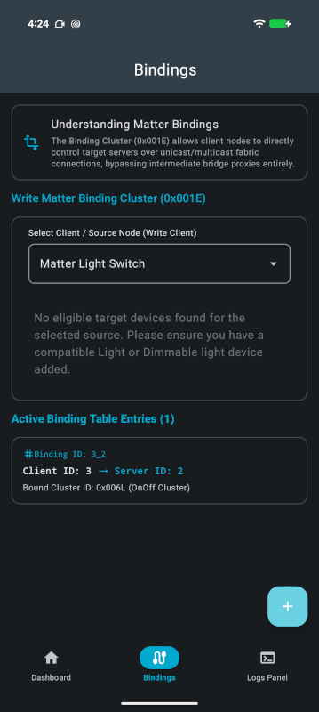

# Configuring bindings

The Bindings screen configures the Binding Cluster (`0x001E`) to allow a client node, such as a
light switch, to control a target node directly over the Matter fabric, without routing each command
through the app. Once the binding is established, the light switch can communicate directly with and
control the connected light bulb. At the time of writing, only **unicast binding** is supported.

  
  
  

The Binding screen consists of three sections.

| Section                                   | Description                                                                                                                                                                                                                                   |
|-------------------------------------------|-----------------------------------------------------------------------------------------------------------------------------------------------------------------------------------------------------------------------------------------------|
| **Understanding Matter Bindings**         | An explanation of the Binding Cluster for users who want to learn more about binding before setting up binding between two devices. It also provides a link to the nRF Connect SDK Light Switch sample documentation for further exploration. |
| **Write Matter Binding Cluster (0x001E)** | In this section, users can select a source device from the available options, such as a light switch, and a target device, such as a light bulb. At the time of writing, binding is supported only for the On/Off Cluster (0x0006).           |
| **Active Binding Table Entries**          | This section displays a list of active bindings, including the source and target node IDs and the cluster associated with each binding.                                                                                                       |

## Writing a binding

1. Open the **Bindings** tab.
2. Under **Select Client / Source Node (Write Client)**, select the source node, such as a light
   switch, that will send the commands. Each entry is identified by its product name and node ID. If
   no client node has been commissioned, the user should commission a source device before creating
   a binding.
3. Under **Select Server / Target Node (Control Target)**, select the target node that you want to
   control. Only light bulbs that are not already bound to the selected source node are available
   for selection.
4. Tap **Write Binding** to initiate binding operation between the selected source and target nodes.

While the binding operation is in progress, it is recommended to keep the app open and avoid
closing it. The stream of Matter traffic generated during the process is displayed in the log, providing an
overview of the binding operation and its progress.

If the binding operation succeeds, the active bindings list is updated automatically, and a toast
message confirms that the binding was successful. If the operation fails, a **Binding Failed**
dialog is displayed. The user can **Retry** to attempt the operation again or cancel and
troubleshoot the issue using the logs in the logs panel.

## What writing a binding does

Writing a binding involves two operations on two different accessories:

1. An *operate* privilege is granted in the light's Access Control List, so the switch is allowed to
   command it.
2. A binding entry is written into the switch's Binding Table.

At the time of writing, only unicast bindings are supported.

## Active binding table entries

This section displays a list of active bindings, including the source and target node IDs and the
cluster associated with each binding.
A binding entry is automatically updated when either of the referenced devices is decommissioned or
removed from the network.
